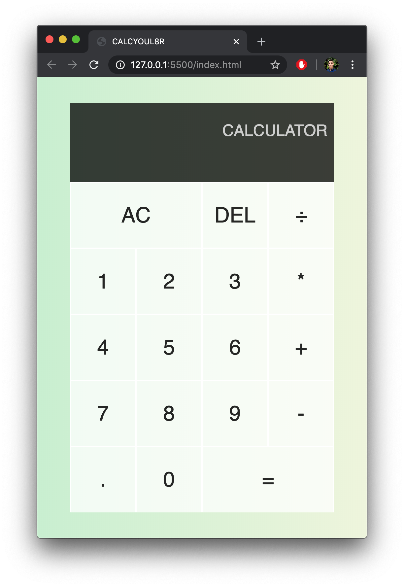

# Calculator: A calculator
by mrivasperez - live demo: https://mrivasperez.github.io/calculator/

## About
This is a simple calculator I made while learning JavaScript and DOM manipulation. It's got a simple, modern, and elegant interface with a beautiful green gradient background. I built it using HTML, CSS, and Vanilla JS.

## Screenshot
